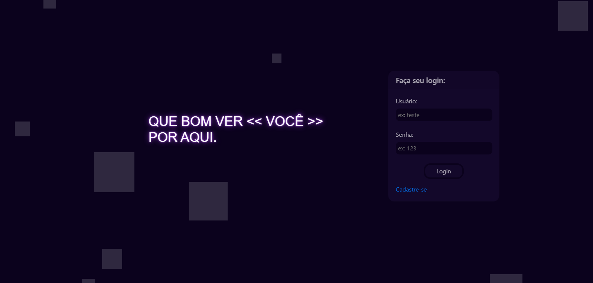
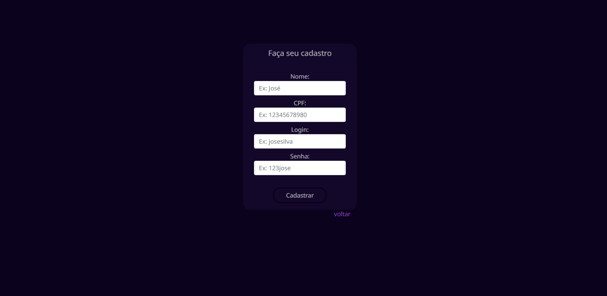
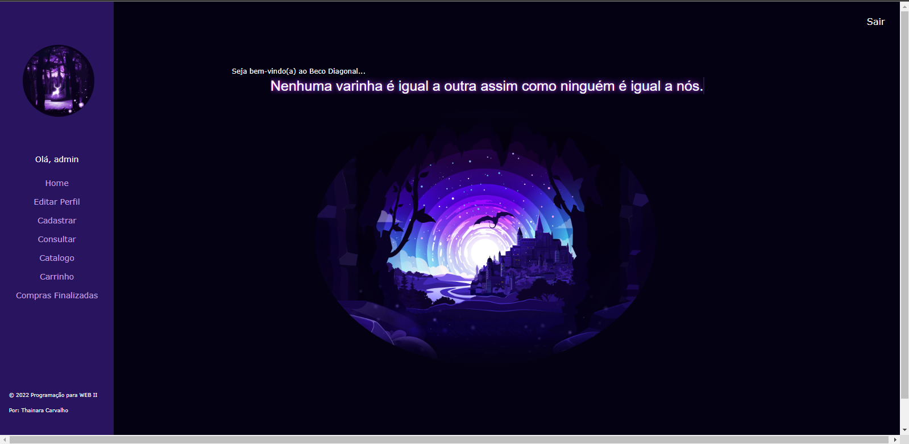
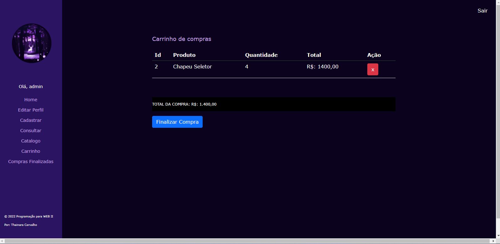

# venda-de-produtos 
projeto realizado na matéria de Programação para Web II - Professor: Fagno Fonseca   
home/login:  
   
cadastro:  
   
home - usuário logado:  
   
carrinho de compras:  
   

CRUD DE UMA LOJA DE VENDAS DE PRODUTOS,  
BACK-END: realizado em Java com Spring boot e injeção JPA com hibernate.  
FRONT-END: html, css e javascript  
BANCO DE DADOS: postgresql

OBS: AO CADASTRAR ADMIN E USER NA TABELA: ADMIN_ROLE ADMIN_USER
